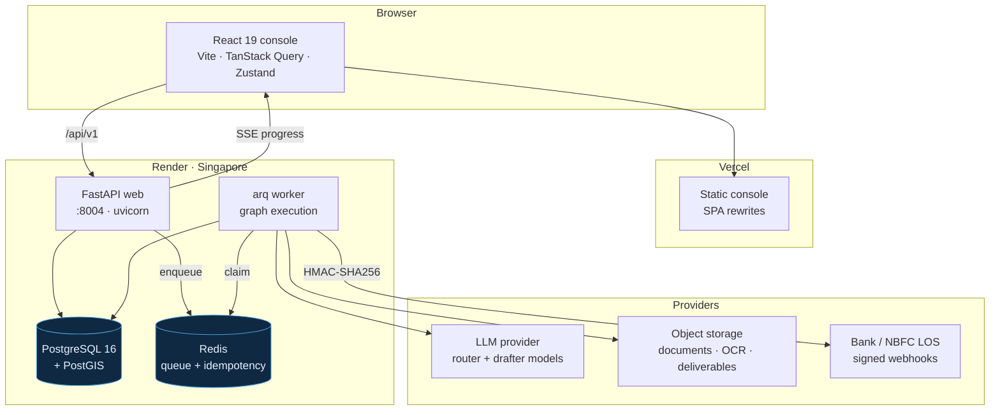
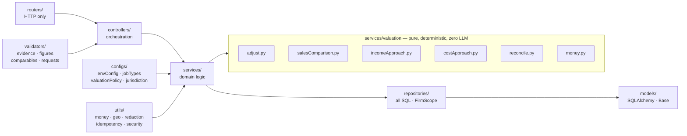
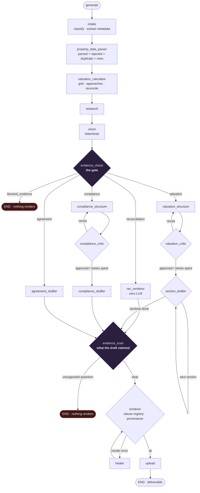
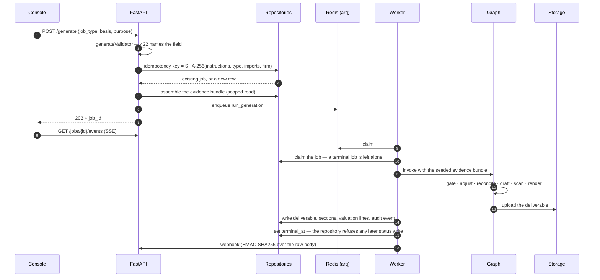
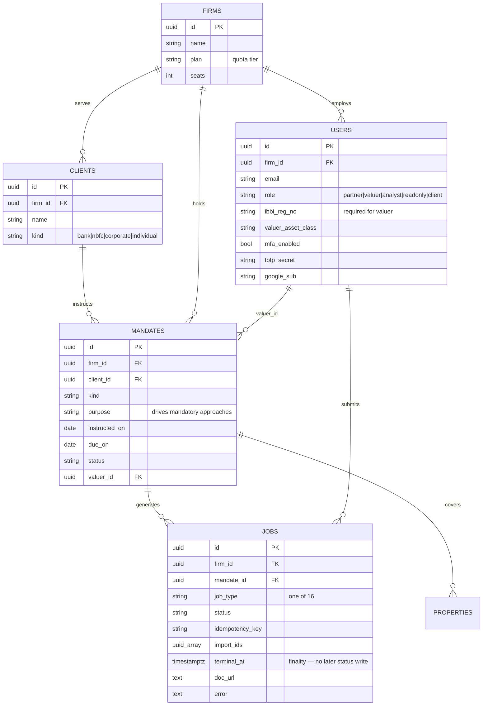
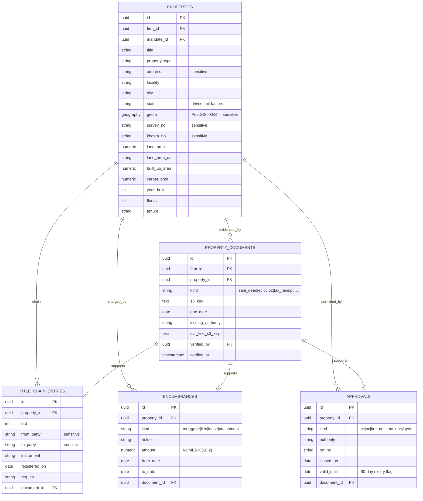
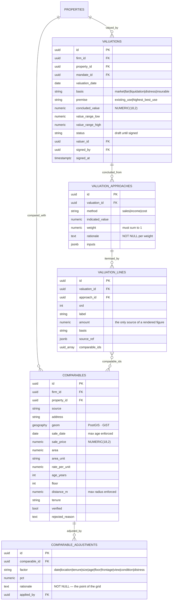
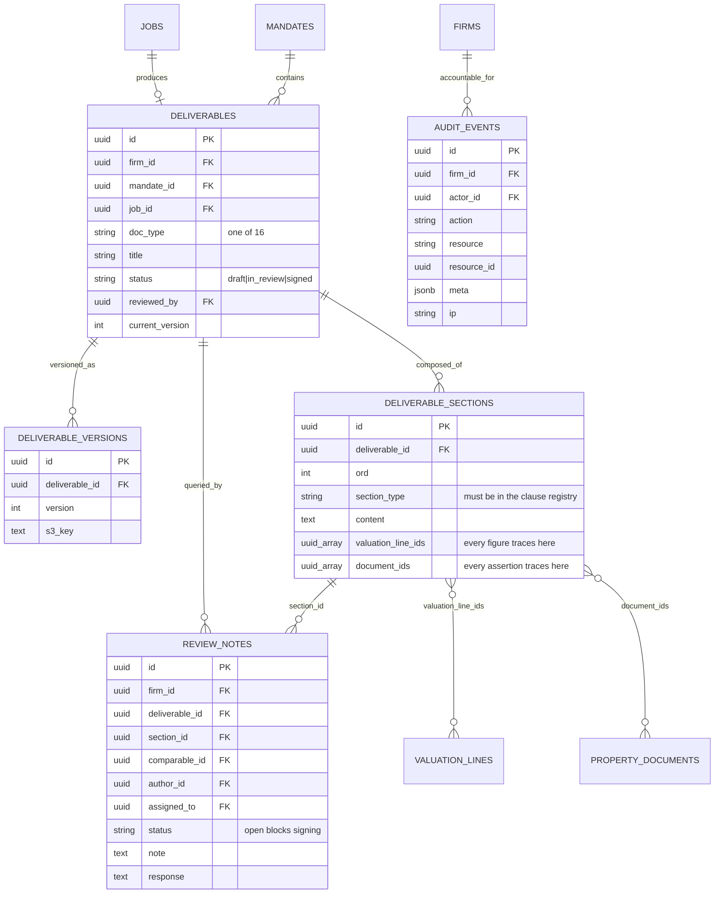

# Real Estate Factory

A property system of record for Indian real estate: valuations, RERA filings and
transaction documents where **every figure traces to a comparable and every legal
assertion to a document**.

A React console over a FastAPI + LangGraph engine. It ingests comparables, lease
schedules, construction stages and land records; computes a valuation from an
adjustment grid reconciled across three approaches; refuses to render an
assertion nothing supports; and produces DOCX, PDF, XLSX and JSON deliverables
that a bank credit officer, an IBBI reviewer or a tribunal can follow line by
line.

Computation is deterministic and lives in Python. Drafting is a model's job, and
**the model writes commentary *about* figures it never originates**.

```
backend/     FastAPI + LangGraph engine, Python 3.12, uv
frontend/    Vite + React 19 + TypeScript console, yarn
packages/    api-types (generated from OpenAPI) · units (one conversion table)
docs/        the data-flow note (S20)
```

---

# Part I · Product specification

## 1. What this product is

A valuation firm's work is not a number. It is a number a reviewer can take
apart: which comparables, adjusted how much, for what stated reason; which
approaches, weighted how, and why; which document supports the sentence that says
the title is clear. The deliverable is a professional opinion whose defensibility
lives in its trail.

This system exists because a language model will happily produce all of it —
figures, title assertions, an unadjusted mean called a valuation — with no trail
at all. So the trail is enforced structurally, not by prompt instruction:

| Rule | Where it is enforced | What it refuses |
|---|---|---|
| The model never produces a number | `validators/figureProvenanceValidator.py` | A figure in prose with no `valuation_line` behind it blocks the render |
| The model never asserts a fact about title | `validators/evidenceValidator.py` | Ownership, tenure, encumbrance or approval without a document blocks the job — **no bypass parameter exists** |
| An unadjusted mean is not a valuation | `valuation/adjust.py`, `validators/comparableValidator.py` | A sample too small, too old, too far, or still disagreeing after adjustment |
| Approaches are reconciled, never averaged | `valuation/reconcile.py` | Weights that do not sum to 1, a weight with no rationale, approaches that diverge past the threshold |
| `Decimal` everywhere, one unit table | `valuation/money.py`, `packages/units/units.json` | A `float` reaching money; a state-dependent area unit converting without an explicit opt-in |
| Nothing is dropped silently | `services/ingest/` | parsed + rejected + duplicate must equal the input row count; rejects are visible in the console |
| Tenancy is enforced at the repository layer | `services/access/scope.py`, `tests/test_repository_scope_guard.py` | A repository function callable without a `FirmScope` — the build fails |
| Location and ownership are sensitive | `utils/redaction.py`, `utils/security.py` | Coordinates, owner names and survey numbers in logs or client-role responses |
| The output is a draft until signed | `access/authz.py`, `render/docxRenderer.py` | Signing without a covering IBBI registration, signing with an open review note; an unsigned export carries **"Draft — not for reliance"** |

## 2. The regulated basis

Settled in §11.1 of the plan: **IBBI-registered valuation** (IBC and Companies
Act) and **bank panel valuation**. That choice is what makes the rules above
non-negotiable rather than tasteful — these accounts sign documents a bank or a
tribunal relies on.

Consequences that show up in the schema and the gates:

- A `valuer` account cannot exist without an `ibbi_reg_no` and an asset class.
- Only a partner or a registered valuer may sign, and S13 checks the
  registration covers the asset class of what is being signed.
- **MFA is on by default** (`MFA_REQUIRED=true`). Turning it off is a deliberate
  act with a name attached.
- `JWT_SECRET` has no default. Boot fails naming it, as does a missing
  `GROQ_API_KEY`.

## 3. Who uses it

| Role | May | May not |
|---|---|---|
| `partner` | everything, including sign | — |
| `valuer` | prepare, review, sign within their registered asset class | sign outside their asset class |
| `analyst` | create and edit records, prepare deliverables | review, sign |
| `readonly` | read the firm's work | write anything |
| `client` | read one mandate, scoped to it | see exact coordinates, owner names, survey numbers, or anything outside that mandate |

The firm comes from a signed token. **No endpoint accepts a firm id.** A
cross-firm read answers **404, never 403** — "you may not read this" confirms the
row exists, and for a mandate name or a property address that confirmation is the
leak.

## 4. What it produces — 16 job types, 4 graph paths

| Path | Job types | How it drafts |
|---|---|---|
| **valuation** | `valuation_report`, `due_diligence_report`, `construction_disbursement_report` | structure → critic loop → section-by-section iterative drafting |
| **compliance** | `rera_registration`, `rera_quarterly_report`, `fema_compliance`, `environment_impact_assessment`, `noc_application` | structure → critic loop → single drafter |
| **agreement** | `sale_deed`, `lease_agreement`, `rental_agreement`, `development_agreement`, `mou`, `power_of_attorney` | single-shot drafting against a clause schedule |
| **reconciliation** | `rent_roll_report`, `portfolio_report` | **deterministic, zero LLM for content** |

Every one of the 16 has a golden fixture: a fixed input, a recorded cassette in
place of the provider, and an expected observation compared on job type, section
sequence, every computed figure and the rendered document's hash.

## 5. How a valuation is reached

### 5.1 The adjustment grid (S7)

Each comparable is adjusted in a fixed compounding order — transaction date,
location, tenure, size, age, floor, frontage, view, condition, distress — and
**the schema refuses to hold an adjustment without a written rationale**. The
result is an adjusted rate per comparable that a reviewer can follow across the
row.

Sample adequacy is a blocking check, not a warning: minimum comparable count,
maximum age, maximum radius, and a refusal when the adjusted spread still exceeds
the configured threshold, because a wide spread means the comparables are not
comparable.

On the golden set's eight comparables the change is not cosmetic:

| | rate | value on 1,450 sq ft |
|---|---|---|
| trimmed mean of raw rates (before) | ₹7,499.59 | ₹1,08,74,405 |
| mean of adjusted rates (after) | ₹7,779.07 | ₹1,12,79,649 |

The raw rates disagreed by 25.3%; after adjustment they agree within 3.1%. That
narrowing is the evidence the grid is doing defensible work.

The trimmed mean survives only as `trimmed_mean_rate_sanity_only`. Nothing in the
codebase returns a key a caller could mistake for a value conclusion.

### 5.2 Three approaches and their reconciliation (S9)

`salesComparison.py`, `incomeApproach.py` (NOI, cap rate, DCF) and
`costApproach.py` (replacement cost less depreciation) are first-class methods.
Each writes a `valuation_approach` row with an indicated value, a weight and a
**rationale for that weight**.

The basis of value (`market | fair | liquidation | distress | insurable`) and the
mandate's purpose decide which approaches are mandatory. A lending valuation of a
tenanted property cannot be concluded on comparable sales alone; an insurable
value cannot lean on market evidence at all.

From the golden set:

```
sales   ₹     240,000,000  weight 0.25
income  ₹  261,768,562.42  weight 0.60
cost    ₹  226,545,600.00  weight 0.15
range   ₹  226,545,600.00 to ₹261,768,562.42     divergence 15.55%
CONCLUDED ₹  251,042,977.45
```

### 5.3 The evidence gate (S8)

`evidenceCheck` sits **before the structure nodes**, so a property that cannot
support the report is refused before a token is spent drafting one. Every
assertion of legal or physical fact — ownership, tenure, encumbrance status,
approvals held, area, age — must resolve to a `property_document`, a
`title_chain_entry`, an `encumbrance` or an `approval`.

An unsupported assertion **blocks the render**. It is never softened into hedged
prose, because the hedge is what a lender skips. `evidenceValidator.enforce`
takes no `force`, `allow_missing` or `strict` parameter, and a test asserts that
by inspecting its signature.

A second pass, `evidenceScan`, runs on the drafted text: the gate checks what the
property can support, the scan checks what the draft actually claimed.

### 5.4 Provenance and review (S12, S13)

`deliverable_sections` carry `valuation_line_ids` and `document_ids`;
`valuation_lines` carry `source_ref` and `comparable_ids`.
`GET /deliverables/{id}/provenance` walks the whole chain, so clicking a figure
in the console shows the line, the adjusted comparables behind it and the source
sheet — and clicking a title statement shows the registered instrument.

Sign-off is a gate, not a button: an analyst prepares, a valuer raises notes, the
analyst responds, and only a partner or a registered valuer whose registration
covers the asset class may sign — with no note left open. Every read and export
writes an `audit_event` with actor, IP and timestamp.

## 6. Beyond the valuation

- **Compliance (S14).** State-wise RERA registration and quarterly obligations
  with a due-date engine; approvals (CC, OC, fire, environment NOC, layout) with
  validity and a 90-day expiry flag; stamp duty computed against both
  consideration and circle rate with **the higher applied**.
- **Portfolio and rent roll (S16).** WAULT, expiry profile, vacancy and
  escalation as of any date; roll-up with concentration by tenant, city and asset
  class; construction disbursement checked against the certified stage
  percentage, so a tranche request ahead of physical progress is flagged rather
  than paid.
- **Retrieval (S17).** Firm-scoped search over the firm's own reporting corpus so
  the drafter reuses house wording. It feeds **commentary only** — figures and
  factual assertions continue to come from `valuation_lines` and
  `property_documents`, and a filter strips any figure from retrieved text. A
  cross-firm attempt returns nothing and writes an audit event.
- **Integration surface (S18).** HMAC-SHA256-signed webhooks over the raw body
  with the timestamp in the signed payload, backoff and a dead-letter state;
  SSE job progress; per-plan quotas answering 429 as a real UI state.
- **Exports (S15).** DOCX, PDF, JSON, and an **XLSX whose adjustment grid keeps
  live formulas** — a reviewer changes an adjustment and watches the rate move.
  Cells are neutralised against formula injection: a tenant name beginning `=`
  exports as inert text.
- **Cost (S11).** A ledger prices every model call from a table of provider rates
  in exact `Decimal`, so a run's rupee figure can be hand-calculated from
  published pricing and matched to the paisa.

---

# Part II · Architecture

## 1. Topology



Migrations never run inside the web process — `alembic upgrade head` is a
pre-deploy step.

## 2. Backend layering

Strictly one direction. Route handlers are under 15 lines and contain no SQL.



Two rules hold this shape:

- **`services/valuation/` is pure.** No LLM call belongs in it, now or later.
- **Every repository function takes a `FirmScope` and filters by it.**
  `tests/test_repository_scope_guard.py` fails the build if one does not. Six
  functions are exempt, each listed in `UNSCOPED_BY_DESIGN` with the reason there
  is no session to scope by.

## 3. The generation graph

18 nodes across 4 paths, with two places a job can end on purpose. No module in
`graph/` exceeds 200 lines and `builder.py` holds zero prompt text — both are
asserted by the golden harness.



The critic loops are bounded by `MAX_CRITIC_RETRIES`, the healer by
`MAX_HEALER_RETRIES`. The renderer validates every section type against the
clause registry — an unregistered type raises rather than falling through to a
generic paragraph.

## 4. A generation, end to end



**Tasks are safe to run twice**, because at-least-once is what a queue gives you.
`run_generation` claims the job first and leaves a terminal one alone. Once
`jobs.terminal_at` is set, `jobRepository` refuses any further write to `status`
— enforced at the repository layer because there are several writers: the web
process, the worker, and the retention sweep.

## 5. The console

Feature-first. A feature imports freely from `components/`, `global/`, `hooks/`,
`shared/`, `store/` and `utils/` — and from another feature **only through its
`index.ts`**, which eslint enforces.

```mermaid
flowchart TB
    subgraph features["src/features/ — one directory per capability"]
        auth["auth<br/>MFA challenge · guards"]
        comps["comparables<br/>map · editable grid · adequacy"]
        vals["valuations<br/>approach cards · range bar"]
        deliv["deliverables<br/>provenance view · export drawer"]
        review["review<br/>notes · sign-off gate"]
        rera["rera<br/>calendar · approvals · stamp duty"]
        dash["dashboard<br/>rent roll · roll-up · disbursement"]
        integ["integration<br/>webhook tester · SSE console"]
        retr["retrieval<br/>corpus search"]
    end

    subgraph shared_["shared layers"]
        api["global/apiClient<br/>the only fetch"]
        types["@realestate-factory/api-types<br/>generated from OpenAPI"]
        units["@realestate-factory/units<br/>one conversion table"]
        query["TanStack Query<br/>server state"]
        z["Zustand<br/>what the user is doing now"]
    end

    features --> api
    api --> types
    features --> query
    features --> z
    features --> units
```



- **The bearer token is held in memory, never `localStorage`.** A token that
  survives a tab close is one any script on the page can read.
- **Money is a decimal string and the console never does arithmetic on it.** A
  figure computed in the browser is a figure the report cannot trace.
- **Types are generated, not mirrored.** Change a backend schema, run
  `make api-types`, commit the result — CI regenerates and diffs, so stale types
  fail the build.

---

# Part III · Data model

20 tables. Every tenanted table carries a `firm_id` that is `NOT NULL` — CI
asserts it against the live schema, because a row belonging to no firm is
invisible to every tenant and therefore unauditable. Money is `NUMERIC(18,2)`
everywhere; `scripts/check_money_columns.py` fails the build on a `Float`.

## 1. Firms, people and work



## 2. The property and its evidence

Nothing asserted about a property renders unless it resolves to a row here.



## 3. The valuation



## 4. Deliverables, review and the audit trail



---

# Part IV · Working in the tree

## Getting started

```bash
make install                       # uv sync + yarn install
cp backend/.env.example backend/.env
cp frontend/.env.example frontend/.env
# set GROQ_API_KEY and JWT_SECRET in backend/.env — neither has a default
make dev                           # postgis + redis + API :8004 + console :5173
make worker                        # the arq worker, in a second shell
```

Requires Python 3.12 (via `uv`), Node 20+, yarn and Docker. `make help` lists
every target.

## Verifying

```bash
make test        # pytest incl. the golden set, plus vitest — no database needed
make test-db     # repository, tenancy and queue proofs against a live PostGIS
make golden      # replay all 16 golden cases and diff figure by figure
make lint        # ruff + eslint + the money-column guard
make typecheck   # mypy + tsc
make schema-sql  # render the whole schema as DDL without touching a database
```

Current state on a clean checkout: **355 backend tests pass** (47 skip without a
live PostGIS/Redis), **23 console tests pass**, ruff and eslint are clean, mypy
and `tsc -b` are clean, the money-column guard passes over 7 monetary columns,
and all 16 golden cases replay.

The structural guards worth knowing about, because they will fail your build:

| Guard | Fails when |
|---|---|
| `tests/test_repository_scope_guard.py` | a repository function is callable without a `FirmScope` |
| `scripts/check_money_columns.py` | a monetary column is not `NUMERIC(18,2)`, in the models *or* in a migration's text |
| `tests/golden/` | a figure moves by a paisa, a section disappears, a `graph/` module passes 200 lines, or `builder.py` gains prompt text |
| `tests/test_s20_security_matrix.py` | a client-role response carries a coordinate or an owner name |
| api-types CI job | a schema changed without `make api-types` |
| backend CI (live DB) | `firm_id` is nullable anywhere, or the GiST index on `properties.geom` is missing |

**`PYTHONHASHSEED=0` is required to run the tests.** `intake_node` builds its
prompt by joining a set, so the prompt text differs between processes and the
golden cassettes stop matching. `make test` sets it.

If a prompt or renderer change is intended, re-record the golden set and put the
diff in the commit — that diff is the review.

## Sprint status

All 21 sprints have landed code. Phase-by-phase:

| | Sprint | State |
|---|---|---|
| S1 | Monorepo split + typed config | done |
| S2 | Postgres + PostGIS, Alembic, death of `jobs.json` | done |
| S3 | Layered HTTP + generated API types | done |
| S4 | Real queue: arq + Redis | done |
| S5 | Auth, firms, mandates, tenancy | done |
| S6 | Decimal migration, units, parser hardening | done |
| S7 | The comparable adjustment grid | done — awaiting a valuer's signed review |
| S8 | The evidence gate | done |
| S9 | Three approaches and their reconciliation | done — awaiting a valuer's manual cross-check |
| S10 | Split `re_graph.py` + golden-set harness | done — 16 fixtures, all paths |
| S11 | Renderer hardening + model routing + cost ledger | done — ledger is in-memory, see gaps |
| S12 | Provenance, documents, audit trail | code complete — **needs a migration** |
| S13 | Review notes, sign-off, encryption, retention | code complete — **needs a migration** |
| S14 | RERA, approvals, statutory compliance | done |
| S15 | Report depth and export breadth | done |
| S16 | Portfolio, rent roll, client view | done |
| S17 | Firm-scoped retrieval | partial — in-memory corpus, no pgvector |
| S18 | Webhooks, SSE, quotas | partial — signing is real, SSE is simulated |
| S19 | Observability, testing, CI/CD | partial — no Playwright critical path |
| S20 | Security, confidentiality, retention | done |
| S21 | Load, cost, closed beta | partial — synthetic harness, no beta cohort |

## Known gaps

Recorded here rather than discovered later. Each is a real hole, not a style
note.

1. **Five tables have no migration.** `deliverables`, `deliverable_versions`,
   `deliverable_sections`, `review_notes` and `audit_events` are declared on
   `Base.metadata` but no Alembic revision creates them, so
   `alembic upgrade head` yields a database where S12's provenance chain and
   S13's review and sign-off cannot run. Their live-DB tests skip locally and the
   CI database job does not reach them, which is why this survived. **This is the
   top of the queue.**
2. **`cost_entries`, `webhook_deliveries` and `node_runs` have no model at all.**
   The cost ledger accumulates in a run-scoped buffer and is never flushed; per
   attempt webhook rows and per node timings are computed and discarded.
3. **S18's SSE stream is a fixed script.** `generate_job_events` yields six
   canned stages with a sleep between them rather than reading `node_runs`. The
   HMAC signing, tamper rejection, backoff and dead-letter states are real.
4. **S17 has no pgvector.** Retrieval is keyword matching over an in-memory
   sample corpus. The firm scoping, the cross-firm audit event and the
   commentary-only figure filter are real and tested; the retrieval itself is
   not over the firm's actual reports.
5. **S19's Playwright critical path does not exist.** The frontend suite is
   Vitest only. The exit proof asks for login → mandate → property → documents →
   comparables → adjust → value → generate → review → sign → export against a
   live preview deploy.
6. **S21's load harness is synthetic.** `benchmarks/loadTester.py` times a
   busy loop rather than driving concurrent generations with k6 or locust, so the
   p95 figures it reports are not measurements of this system.
7. **`Decimal(str(x))` appears in the S14/S16/S21 services.** That is the exact
   laundering `to_decimal` refuses — it raises on a `float` rather than
   converting imprecision it cannot undo. Those call sites should go through
   `money.to_decimal`.
8. **Two exit proofs cannot be met in code**, both of which ask for a person:
   S7's "an IBBI-registered valuer reviews one full grid and signs it" and S9's
   "a valuer compares the reconciled figure against their own manual working".
   The arithmetic is built and tested; the professional review is not something
   the repository can do to itself. S14 and S15 add two more of the same shape.

## Open decisions

§11 of the plan listed three. Two are settled — the regulated basis (IBBI and
bank panel) and the `repositories` spelling. One is still open:

**Who maintains jurisdictional data** — RERA rules, stamp duty, circle rates,
unit conventions. A standing cost with an owner and a review cadence. It was due
before S14, which has now shipped against commonly cited values;
`packages/units/units.json` still carries the state-dependent factors as
`verified: false`, refusing to convert without an explicit opt-in.

---

`REALESTATE_FACTORY_SPRINTS.md` is the plan, including what was structurally
wrong at the start and the order it was fixed. `CLAUDE.md` is how to work in this
tree.
